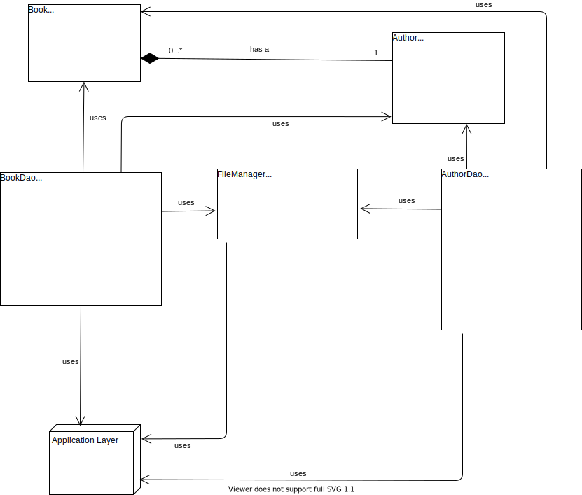
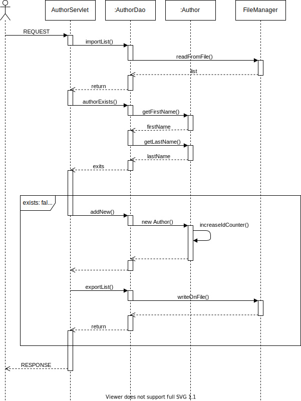
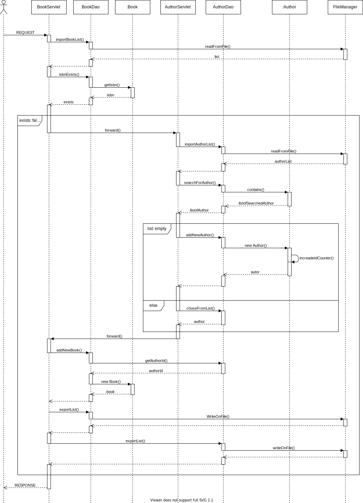

= image:docs/openbook.png[] Bücherverwaltung
Safiye Uzun <safiye.uzun@msg.group>
v1.0, 2021-02-11
:toc:
:toc-title: Inhaltsverzeichnis

:sectnums:
== Einführung

=== Projektbeschreibung

Bei diesem Projekt handelt es sich um ein vollwertiges Bücherverwaltungssystem auf Web Basis. +
Ziel der Webapplikation ist es, dem individuellen Nutzer eine leichte Verwaltung für dessen Bücher zu ermöglichen. +
Zusätzlich soll es möglich sein, neben Büchern auch separat Autoren zu verwalten. +
Dabei ist eine wichtige Voraussetzung, dass Bücher immer einen Autor haben müssen, wohingegen Autoren auch ohne Bücher existieren können. +
Die Basis des Projektes ist zunächst als Aufgabenstellung zum Erlernen der Java Grundkenntnisse im ersten Ausbildungsjahr entstanden. Mit der Zeit wurde der Umfang des Projektes vonseiten der Ausbilder immer mehr erweitert.

=== Einschränkungen
Aufgrund der noch fehlenden Kenntnisse besteht die aktuelle Version der Applikation noch aus einer selbst-definierten Datenbank ohne JDBC _(Java Database Connectivity)_. Aus diesem Grund kann die Kapazität der Bücher eingeschränkt sein.

== Technische Grundlagen

=== Plattform
- Server: Tomcat 8.5.61
- Build Tool: Maven 3.1
- JDK: 11.0.8.10
- external libraries:

=== Grafische Nutzeroberfläche

_SCREENSHOT HERE_

_TEXT HERE_

== Struktur und Modelle

=== Diagramme
Der _User_ kann in der Buchverwaltungsapplikation die Listen ausgeben, Einträge löschen sowie neue Einträge erstellen.

image:docs/dias/usecase.svg[]

=== Klassenmodell

_TEXT HIER_

=== Funktionsweise
Funktionsweise der Speicherung von Autoren durch den Nutzer:

Funktionsweise der Speicherung von Büchern durch den Nutzer:

== API Dokumentation

_TEXT HIER_
//TODO

