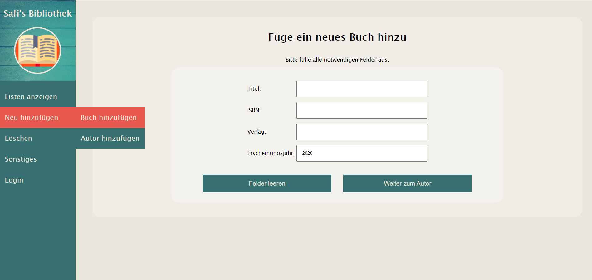
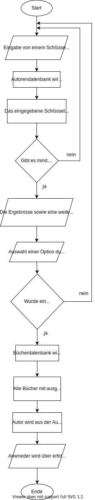

= image:docs/img/openbook.png[] Bücherverwaltung
Safiye Uzun <safiye.uzun@msg.group>
v1.0, 2021-02-11
:toc:
:toc-title: Inhaltsverzeichnis

== Einleitung

Die Bücherverwaltungsapplikation ist eine Webanwendung, die die Verwaltung von Büchern und Autoren ermöglicht. +
Die Applikation wird in link:#war_datei_[.war Dateiformat] geliefert und beinhaltet bereits eine kleine Sammlung an Beispielbüchern und -autoren.

====
*Nachträglich eingebaut:* (09.04.2021) +
Java FileManager durch mySQL Datenbank ersetzt.
====

=== Zielgruppen

Bei dieser Anwendung handelt es sich um ein Prototyp, welches im Lernprozess der Ausbildung entstanden ist und nur im Rahmen der Ausbildung verwendet werden sollte. +
Prinzipiell ist die Applikation aber für Nutzer gedacht, die ihre eigene private Bücherbibliothek in einem Verzeichnis speichern möchten, um diese leichter zu verwalten.

=== Beschreibung

Der Anwender kann in der Bücherverwaltungsapplikation folgende Aufgaben erledigen:

- die gespeicherten Bücher als Liste ausgeben
- die gespeicherten Autoren als Liste ausgeben
- neue Büchereinträge tätigen
- neue Autoreneinträge tätigen
- vorhandene Büchereinträge löschen
- vorhandene Autoreneinträge löschen

=== Erwähnenswertes
Die Projektidee ist im ersten Jahr der Ausbildung entstanden, um bereits gelernte Java Kenntnisse in einem Projekt einzubringen und weiterzuentwickeln. +
Begonnen hat das Projekt dabei mit einer einfachen Konsolenanwendung, da zu diesem Zeitpunkt erst die Java Grundkenntnisse erlernt werden mussten. +
Die Konsolenanwendung hat die gleichen Programmstrukturen und -funktionen, allerdings ohne eine Web-UI. +
Die Anwendung kann im `cmd/app` Branch in GitLab angeschaut werden. +
Aufbauend auf den bereits erstellten Datenstrukturen ist die Web-Applikation und später die dazugehörige API entstanden.

.geschätzter zeitlicher Aufwand
[cols=4*]
|====
h| Konsolen-Applikation
h| Web-Applikation
h| RESTful API
h| JDBC
| ~ 120h
| ~ 100h
| ~ 50h
| ~ 20h
4+^s| Gesamt: ~290h
|====

== Umgebung

=== Installation

Um das Projekt starten zu können, wird ein spezieller Webserver benötigt, der einen link:#web_container_[Web-Server-Container] enthält. Ein Beispiel für einen solchen Webserver ist: *Apache Tomcat*.

Außerdem wird neben einem Webserver auch eine link:#jre_[Java Laufzeitumgebung] benötigt.

.Mindestvoraussetzung der Umgebung:
- Tomcat 8.5
- JRE 8

=== Weitere Einrichtungen

Nach Installation von Tomcat und link:#jre_[JRE] muss eventuell die JAVA_HOME Systemvariable festgelegt werden.

Bei Windows 10 kommt man zu den Einstellungen über
*Systemsteuerung* => *System und Sicherheit* => *System* => *erweiterte Systemeinstellungen* => *Erweitert* => *Umgebungsvariablen*.
Bei den Systemvariablen kann man eine neue Variable definieren.

Name der Variable soll sein: `*JAVA_HOME*`. Der dazugehörige Wert entspricht dem Verzeichnispfad, indem sich die installierte link:#jre_[Java Laufzeitumgebung] befindet. +
Sollte das Verzeichnis nicht auffindbar sein, kann über die Eingabeaufforderung (_command prompt_) ebenfalls nach dem Verzeichnis suchen.
[source,bash]
----
C:\Users\user> where java
----

Als Antwort erhält man, falls eine link:#jre_[JRE] installiert wurde, den Speicherort im Rechner.

[source,bash]
----
C:\Program Files\AdoptOpenJDK\jre-11.0.9.101-hotspot\bin\java.exe
----

Als Variablenwert für `*JAVA_HOME*` wird nur der Pfad des gesamten Verzeichnisses benötigt, d.h. ohne `\bin\java.exe`

====
In diesem Beispiel wäre die Systemvariable wie folgt einzutragen:
[cols=2*]
|====
h| Variablenname
h| Variablenwert
| `JAVA_HOME`
| `C:\Program Files\AdoptOpenJDK\jre-11.0.9.101-hotspot`
|====

====

=== Starten

Um die Applikation über den Tomcat Server bereitzustellen (_deployen_), muss die Anwendung manuell in das Verzeichnis kopiert werden, in dem der Tomcat Server installiert wurde.

So könnte das Verzeichnis beispielsweise aussehen:

image:docs/img/Screenshot 2021-02-16 003239.png[]

Die Applikationsdatei muss in den `\webapps` Ordner kopiert oder verschoben werden.

Nachdem die Datei erfolgreich verschoben wurde, kann der Server über die _command prompt_ gestartet werden:

[source,shell script]
----
C:\Users>cd C:\dev\env\Tomcat8.5\bin

C:\dev\env\Tomcat8.5\bin>startup
----

Die Applikation ist ab jetzt startbereit.

Mit einem beliebigen Browser kann man den link:#local_server_[lokalen Server] durch
`\http://localhost:8080/` erreichen.

Um die Applikation zu öffnen, muss als URL der Name der Datei mit angegeben werden.

[#u_r_l]
====
Wenn beispielsweise der Dateiname der Applikation `book-app.war` lautet,
dann ist diese nun über den link `\http://localhost:8080/book-app/` erreichbar.
====

== Nutzeroberfläche

Die Nutzeroberfläche der Applikation ist auf Basis von HTML und CSS aufgebaut. +
Jeder Anwendungsfall stellt eine komplett eigene Einheit dar und kann vom Anwender jederzeit über das Navigationsmenü erreicht werden.

Für die Eingabe vonseiten des Anwenders werden Textfelder zur Verfügung gestellt (beispielsweise beim Hinzufügen von neuen Einträgen).

=== Beispiele

image:docs/img/add-author.png[]

== Programmverlauf

=== Anwendungsfälle
image:docs/dias/usecase.svg[]

Jeder Anwender hat vollen Zugriff auf die Bücher- und Autorenverwaltung und ist nicht auf eine bestimmte Personengruppe eingeschränkt.

Im nächsten Schritt werden die einzelnen Fälle näher erläutert.

[INFO]
====
Wichtig: Bei allen Anwendungsprozessen, in denen eine Eingabe durch den Anwender benötigt wird, ist davon auszugehen, dass die Eingabefelder ausgefüllt sind. Grundsätzlich gilt in der gesamten Anwendung, dass keine Felder leer stehen dürfen. +
_Ausnahme: Falsche oder unzulässige Jahresangaben werden durch das Jahr 2000 ersetzt._
====

=== Alle Einträge ausgeben

Bei den Fällen `Autoren ausgeben` und `Bücher ausgeben` handelt es sich um getrennte Prozesse und sollte deswegen grundsätzlich getrennt betrachtet werden. +
Aufgrund der Ähnlichkeiten und für eine bessere Verständlichkeit werden sie hier teilweise zusammengefasst.

[width=100%, cols=3*,frame=topbot, grid=rows]
|====
^.h|Name
^s| Alle Autoren
^s| Alle Bücher

^.h|Ziel
| Eine sortierbare Liste aller in der Datenbank vorhandenen Autoren anzeigen
| Eine sortierbare Liste aller in der Datenbank vorhandenen Bücher anzeigen

^.h|Akteure
|Alle Benutzer der Applikation
|Alle Benutzer der Applikation

^.h|Vorbedingungen
^| -
^| -

^.h|Prozess
| Autorendatenbank wird ausgelesen und dem Anwender tabellarisch angezeigt
| Bücherdatenbank wird ausgelesen und dem Anwender tabellarisch angezeigt

^.h| Weitere Optionen
| Die ausgegebene Tabelle kann vom Anwender alphabetisch nach *Vorname* oder *Nachname* sortiert werden
| Die ausgegebene Tabelle kann vom Anwender alphabetisch nach *Titel*, *Vorlage* oder numerisch nach *ISBN* sortiert werden

|====

====
Die genannten Optionen der Sortierung sind aktuell nur in eine Richtung möglich.

- Alphabetisch ist immer in alphabetischer Reihenfolge beginnend mit _a_
- Numerisch immer beginnend mit der kleinsten Zahl
====

=== Einträge hinzufügen

Die Fälle `Autor hinzufügen` und `Buch hinzufügen` sind ebenso getrennt voneinander zu betrachten, werden allerdings hier für eine bessere Verständlichkeit teilweise zusammengefasst.

[width=100%,cols=3*,frame=topbot, grid=rows]
|====
^h|Name
s|Autor hinzufügen
s| Buch hinzufügen

^.h|Ziel
|Einen neuen Eintrag in die Autorendatenbank tätigen
| Einen neuen Eintrag in die Bücherdatenbank tätigen

^.h|Akteure
|Alle Benutzer der Applikation
|Alle Benutzer der Applikation

^.h|Vorbedingungen
|Autor mit demselben Namen existiert noch nicht in der Datenbank
|Buch-ISBN existiert noch nicht als Eintrag in der Datenbank
|====
[width=100%,cols= 2*, frame=topbot, grid=cols]
|====
^h| _Autor hinzufügen_ Prozess
^h| _Buch hinzufügen_ Prozess

^| image:docs/dias/add-author-pap.svg[]
^| image:docs/dias/add-book-pap.svg[]

|====

=== Einträge löschen

Die Fälle `Autor löschen` und `Buch löschen` sind getrennte Prozesse, die hier aufgrund besserer Verständlichkeit teilweise zusammengefasst werden.

[width=100%,cols=3*,frame=topbot, grid=rows]
|====
^h|Name
s|Autor löschen
s| Buch löschen

^.h|Ziel
|Einen ausgewählten Autor aus der Bücherdatenbank entfernen
| Ein ausgewähltes Buch aus der Bücherdatenbank entfernen

^.h|Akteure
|Alle Benutzer der Applikation
|Alle Benutzer der Applikation

.2+^.h|Vorbedingungen
|Gesuchter Autor existiert in der Datenbank
| Gesuchtes Schlüsselwort ist in Bücherdatenbank enthalten
|====

[width=100%,cols= 2*, frame=topbot, grid=cols]
|====
^h| _Autor löschen_ Prozess
^h| _Buch löschen_ Prozess

^| 
^| image:docs/dias/delete-book-pap.svg[]
|====

== API Dokumentation

=== Übersicht
Die API der Bücherapplikation basiert auf dem REST Prinzip und ermöglicht eine externe Kommunikation direkt mit den Daten hinter der Anwendung.

[cols= 2*, frame=topbot, grid=rows]
|====
h| API URL
| `\{Root_URL}/api/v1/`

h| Version
| v1

h| Response Format
| JSON
|====

Es stehen zwei Ressourcen, Buch und Autor, zur Verfügung und die Daten sind nach folgendem Schema aufgebaut:
[cols=4*, frame= none, grid = all]
|====
2+^h| Buch
2+^h| Autor
h|Key
h|Datentyp
h| Key
h| Datentyp
m|title
|String
m|first_name
|String
m|isbn
|String
m|last_name
|String
m|publisher
|String
m|id
|int
m|year
|int
m|books
|List
m|author
|Object
2+|

|====

Die API Endpunkte können dabei in drei Kategorien unterteilt werden: link:#Suche[Suche], link:#Buecher[Buch] und link:#Autoren[Autor] API.

[#Suche]
=== Suche

==== Suche nach Büchern

In der Suche API kann im Bücher-Endpunkt nach Büchern gesucht werden, und die Suchergebnisse werden als Liste im JSON Format ausgegeben. +

Eine Büchersuche über die API gibt *immer* den Status Code `200` aus, auch wenn keine mit der Suchanfrage übereinstimmende Ressourcen gefunden werden.
Suchanfragen ohne Ergebnisse werden durch eine leere Liste in der JSON Response gekennzeichnet.

[cols= 3*, frame=topbot, grid=rows]
|====
h| Beschreibung
2+| Ermöglicht die Suche in Büchern nach bestimmten Kategorien

h| Endpunkt URL
2+| `\{Root_URL}/api/v1/search/book/\{Kategorie}/\{Suchbegriff}`

h| zulässige Methoden
2+| GET

h| Response Code
| 200
| OK

h| Response Body Format
2+| JSON

h| Datenformat
2+| Liste von Bücherobjekten
|====

[cols=2*, frame=topbot, grid=cols]
|====
^h| Beschreibung
^h| \{Kategorie}

|Suche nach Titel
| `titel`

|Suche nach ISBN
| `isbn`

|Suche nach Verlag
| `publisher`

|Suche nach Autor
| `author`
|====

====

.Beispiel 1
*Request:*
[source,http request]
----
GET http://localhost:8080/book-app/api/v1/search/book/title/parfum
----
*Response:*
[source,json]
----
[
  {
    "title": "DAS PARFUM",
    "isbn": "978-3-257-22800-7",
    "author": {
      "id": 20,
      "first_name": "PATRICK",
      "last_name": "SUESKIND"
    },
    "publisher": "DIOGENES",
    "year": 1994
  }
]
----
====

====
.Beispiel 2
*Request:*
[source,http request]
----
GET http://localhost:8080/book-app/api/v1/search/book/author/goethe
----
*Response:*
[source,json]
----
[
  {
    "title": "FAUST",
    "isbn": "978-3-15-000001-4",
    "author": {
      "id": 1,
      "first_name": "JOHANN WOLFGANG",
      "last_name": "GOETHE"
    },
    "publisher": "RECLAM",
    "year": 1986
  },
  {
    "title": "DIE LEIDEN DES JUNGEN WERTHER",
    "isbn": "978-3-15-000067-0",
    "author": {
      "id": 1,
      "first_name": "JOHANN WOLFGANG",
      "last_name": "GOETHE"
    },
    "publisher": "RECLAM",
    "year": 1986
  },
  {
    "title": "DER ERLKOENIG",
    "isbn": "978-3-934029-48-4",
    "author": {
      "id": 1,
      "first_name": "JOHANN WOLFGANG",
      "last_name": "GOETHE"
    },
    "publisher": "KINDERMANN VERLAG",
    "year": 2013
  }
]
----
====

==== Suche nach Autoren

Im Autoren-Endpunkt der Suche API kann speziell nach Autoren gesucht werden. +
Im Vergleich zur Suche nach Büchern wird bei der Autorensuche eine JSON-Liste von Autorobjekten ausgegeben. +
Genauso wie beim Buch-Endpunkt der Suche API wird bei der Suche nach Autoren immer der Status Code `200` ausgegeben.

[cols= 3*, frame=topbot, grid=rows]
|====
h| Beschreibung
2+| Ermöglicht die Suche in Autorendatenbank nach Namen

h| Endpunkt URL
2+| `\{Root_URL}/api/v1/search/author/\{Suchbegriff}`

h| Request Methode
2+| GET

h| Response Code
| 200
| OK

h| Response Body Format
2+| JSON

h| Datenformat
2+| Liste von Autorobjekten
|====

====

.Beispiel
*Request:*
[source,http request]
----
GET http://localhost:8080/book-app/api/v1/search/author/friedrich
----
*Response:*
[source,json]
----
[
  {
    "id": 12,
    "first_name": "FRIEDRICH",
    "last_name": "SCHILLER",
    "books": [
      {
        "title": "WILLHELM TELL",
        "isbn": "978-3-15-000012-0",
        "publisher": "RECLAM",
        "year": 2000
      },
      {
        "title": "MARIA STUART",
        "isbn": "978-3-15-000064-9",
        "publisher": "RECLAM",
        "year": 2001
      }
    ]
  },
  {
    "id": 17,
    "first_name": "FRIEDRICH",
    "last_name": "DUERRENMATT",
    "books": [
      {
        "title": "DER BESUCH DER ALTEN DAME",
        "isbn": "978-3-257-23045-1",
        "publisher": "DIOGENES",
        "year": 1998
      },
      {
        "title": "DIE PHYSIKER",
        "isbn": "978-3-257-23047-5",
        "publisher": "DIOGENES",
        "year": 1998
      }
    ]
  }
]
----
====

[#Buecher]
=== Bücher

==== Alle Bücher ausgeben

[cols= 3*, frame=topbot, grid=rows]
|====
h| Beschreibung
2+| Ermöglicht die Ausgabe von allen Büchern, die gespeichert sind

h| Endpunkt URL
2+| `\{Root_URL}/api/v1/book/`

h| Request Methode
2+| GET

h| Response Code
| 200
| OK

h| Response Body Format
2+| JSON

h| Datenformat
2+| Liste von Bücherobjekten
|====

==== Bücher eines bestimmten Autors ausgeben

[cols= 3*, frame=topbot, grid=rows]
|====
h| Beschreibung
2+| Ermöglicht die Ausgabe von Büchern eines bestimmten Autors nach ID

h| Endpunkt URL
2+| `\{Root_URL}/api/v1/book/author/id/\{Autor_ID}`

h| Request Methode
2+| GET

.2+h| Response Code
| 200
| OK
| 404
| Wird gesendet, wenn gegebene Ressource nicht existiert

h| Response Body Format
2+| JSON

h| Datenformat
2+| Liste von Bücherobjekten
|====

====
.Beispiel
*Request:*
[source,http request]
----
GET http://localhost:8080/book-app/api/v1/book/author/id/21
----
*Response:*
[source,json]
----
[
  {
    "title": "DER PROZESS",
    "isbn": "978-3-423-02644-4",
    "author": {
      "id": 21,
      "first_name": "FRANZ",
      "last_name": "KAFKA"
    },
    "publisher": "DTV",
    "year": 1998
  },
  {
    "title": "DAS SCHLOSS",
    "isbn": "978-3-86647-106-1",
    "author": {
      "id": 21,
      "first_name": "FRANZ",
      "last_name": "KAFKA"
    },
    "publisher": "ANACONDA VERLAG",
    "year": 2007
  }
]
----
====

==== Bestimmte Bücher ausgeben

Anders als bei der Ausgabe der Bücher nach Autoren, wo es mehrere Bücher geben kann, werden bei diesem Endpunkt die Bücher einzeln als Objekt ausgegeben. Die Selektion findet über die ISBN statt.

[cols= 3*, frame=topbot, grid=rows]
|====
h| Beschreibung
2+| Ermöglicht die Ausgabe von einzelnen Buchobjekten

h| Endpunkt URL
2+| `\{Root_URL}/api/v1/book/isbn/\{isbn}`

h| Request Methode
2+| GET

.2+h| Response Code
| 204
| Wird gesendet, wenn erfolgreich gelöscht
| 404
| Wird gesendet, wenn die angegebene Ressource nicht existiert.

h| Response Body Format
2+| JSON

h| Datenformat
2+| Buchobjekt
|====

====
.Beispiel
*Request:*
[source,http request]
----
GET http://localhost:8080/book-app/api/v1/book/isbn/978-3-15-006172-5
----
*Response:*
[source,json]
----
{
  "title": "ROMEO UND JULIA AUF DEM DORFE",
  "isbn": "978-3-15-006172-5",
  "author": {
    "id": 6,
    "first_name": "GOTTFRIED",
    "last_name": "KELLER"
  },
  "publisher": "RECLAM",
  "year": 1998
}
----

====

==== Bestimmte Bücher entfernen

[cols= 3*, frame=topbot, grid=rows]
|====
h| Beschreibung
2+| Ermöglicht die Löschung eines Buchobjektes mit gegebener ISBN

h| Endpunkt URL
2+| `\{Root_URL}/api/v1/book/isbn/\{isbn}`

h| Request Methode
2+| DELETE

.2+h| Response Code
| 204
| Wird gesendet, wenn erfolgreich gelöscht
| 404
| Wird gesendet, wenn die angegebene Ressource nicht existiert

h| Response Body Format
2+| leer

h| Datenformat
2+^| -
|====

====
.Beispiel
*Request:*
[source,http request]
----
DELETE http://localhost:8080/book-app/api/v1/book/isbn/5555-555-555-5
----
====
[#Buecher_eintragen_API]
==== Neues Buch hinzufügen

Für einen neuen Bucheintrag ist die Einhaltung der Datenstruktur eines Buches nicht notwendig. Wichtig ist nur, dass alle notwendigen Keys im Body angegeben werden.
====
Da die Existenz eines Buches ohne Autor nicht möglich ist, ist die Angabe von `first_name` und `last_name` bei einem Buchobjekt Pflicht. Wenn die angegebenen Informationen nicht zu einem existierenden Autor zugeordnet werden können, wir ein neuer Autoreintrag getätigt.
====
[cols= 3*, frame=topbot, grid=rows]
|====
h| Beschreibung
2+| Ermöglicht einen neuen Bucheintrag

h| Endpunkt URL
2+| `\{Root_URL}/api/v1/book/`

h| Request Methode
2+| POST

.3+h| Response Code
| 201
| Wird gesendet, wenn Eintrag erfolgreich war
| 409
| Wird gesendet, wenn Eintag aufgrund bereits existierender ISBN nicht möglich ist
| 400
| Wird gesendet, wenn nicht alle notwendigen Keys angegeben sind

h| Request Body Format
2+| JSON

h| Response Body Format
2+| leer

h| Notwendige Keys
2+|`fist_name, last_name, title, isbn, publisher, year`

|====

====
.Beispiel
*Request:*
[source,http request]
----
POST http://localhost:8080/book-app/api/v1/book/
content-type: application/json

{
  "first_name": "Safiye",
  "last_name": "Uzun",
  "title": "Java",
  "isbn": "111-222-333",
  "publisher": "goldmann",
  "year": "2018"
}
----
====

[#Autoren]
=== Autoren

==== Alle Autoren ausgeben

[cols= 3*, frame=topbot, grid=rows]
|====
h| Beschreibung
2+| Ermöglicht die Ausgabe aller Autoren, die gespeichert sind

h| Endpunkt URL
2+| `\{Root_URL}/api/v1/author/`

h| Request Methode
2+| GET

h| Response Code
| 200
| OK

h| Response Body Format
2+| JSON

h| Datenformat
2+| Liste von Autorobjekten
|====

==== Bestimmten Autor ausgeben

Ähnlich wie bei der Ausgabe einzelner Buchobjekte nach ISBN wird für die Ausgabe von Informationen zu einem Autor die ID benötigt.

[cols= 3*, frame=topbot, grid=rows]
|====
h| Beschreibung
2+| Ermöglicht die Ausgabe von einzelnen Autorobjekten

h| Endpunkt URL
2+| `\{Root_URL}/api/v1/author/id/\{Autor_ID}`

h| Request Methode
2+| GET

.2+h| Response Code
| 204
| Wird gesendet, wenn erfolgreich gelöscht
| 404
| Wird gesendet, wenn die angegebene Ressource nicht existiert.

h| Response Body Format
2+| JSON

h| Datenformat
2+| Autorobjekt
|====

====
.Beispiel
*Request:*
[source,http request]
----
GET http://localhost:8080/book-app/api/v1/author/id/39
----
*Response:*
[source,json]
----
{
  "id": 39,
  "first_name": "MICHELLE",
  "last_name": "OBAMA",
  "books": [
    {
      "title": "BECOMING",
      "isbn": "978-3-442-31487-4",
      "publisher": "GOLDMANN",
      "year": 2018
    }
  ]
}
----
====

==== Bestimmten Autor entfernen

====
Beim Entfernen von Autoren werden aufgrund der Datenstruktur, dass Bücher nicht ohne Autoren existieren können, automatisch auch die Bücher entfernt, die zu diesem Autor zugeordnet waren.
====

[cols= 3*, frame=topbot, grid=rows]
|====
h| Beschreibung
2+| Ermöglicht die Löschung eines Autoreintrages mit gegebener ID

h| Endpunkt URL
2+| `\{Root_URL}/api/v1/author/id/\{Autor_ID}`

h| Request Methode
2+| DELETE

.2+h| Response Code
| 204
| Wird gesendet, wenn erfolgreich gelöscht
| 404
| Wird gesendet, wenn die angegebene Ressource nicht existiert

h| Response Body Format
2+| leer

h| Datenformat
2+^| -
|====

====
.Beispiel
*Request:*
[source,http request]
----
DELETE http://localhost:8080/book-app/api/v1/author/id/40
----
====

==== Informationen zu einem Autor ändern

[cols= 3*, frame=topbot, grid=rows]
|====
h| Beschreibung
2+| Ermöglicht eine Änderung von bereits existierenden Autoren

h| Endpunkt URL
2+| `\{Root_URL}/api/v1/author/id/\{Autor_ID}`

h| Request Methode
2+| PUT

.3+h| Response Code
| 204
| Wird gesendet, wenn Änderung erfolgreich war
| 404
| Wird gesendet, wenn ID nicht exisitert
| 400
| Wird gesendet, wenn ein notwendiger Key fehlt

h| Request Body Format
2+| JSON

h| Response Body Format
2+| leer

h| Notwendige Keys
2+|`fist_name, last_name`

|====

====
.Beispiel
[source,http request]
----
PUT http://localhost:8080/book-app/api/v1/author/id/40

{
  "first_name": "Michelle",
  "last_name": "Obama"
}
----
====

==== Neuen Autor eintragen

Für einen neuen Autoreintrag ist keine zusätzliche Eintragung von einem Buch möglich. Dazugehörige Bücher müssen über den Endpunkt link:#Buecher_eintragen_API[Bücher eintragen API] gemacht werden.
[cols= 3*, frame=topbot, grid=rows]
|====
h| Beschreibung
2+| Ermöglicht einen neuen Autoreintrag

h| Endpunkt URL
2+| `\{Root_URL}/api/v1/autor/`

h| Request Methode
2+| POST

.3+h| Response Code
| 201
| Wird gesendet, wenn Eintrag erfolgreich war
| 409
| Wird gesendet, wenn Eintag aufgrund bereits existierenden Autors nicht möglich ist
| 400
| Wird gesendet, wenn nicht alle notwendigen Keys angegeben sind

h| Request Body Format
2+| JSON

h| Response Body Format
2+| leer

h| Notwendige Keys
2+|`fist_name, last_name`

|====

====
.Beispiel
*Request:*
[source,http request]
----
POST http://localhost:8080/book-app/api/v1/author/
content-type: application/json

{
  "first_name": "Safiye",
  "last_name": "Uzun"
}
----
====

== Glossar

[#war_datei_]
.Web Application Archive

Eine WAR-Datei ist ein komprimiertes Paket, das Java-basierte Webkomponenten und -anwendungen enthält, die auf einem Webserver ausgeführt werden.

[#web_container_]
.Webcontainer
Der Webcontainer, auch als Servlet-Container bezeichnet, ist die Komponente eines Webservers, der mit Java-Servlets interagiert.
Ein Webcontainer ist dafür verantwortlich, den Lebenszyklus von Servlets zu verwalten.

[#servlet_]
.Servlet
Ein Servlet ist eine spezielle Klasse, geschrieben in Java-Quellcode, die HTTP-Anfragen auf einem Webcontainer entgegennehmen und beantworten kann. Dabei werden HTML-Ergebnisseiten erzeugt.

[#local_server_]
.local Server
Ein lokaler Server ist ein Server, der auf einem Arbeitsplatzrechner eingerichtet ist und mit einem auf demselben Rechner vorhandenen Client wie ein Netzwerk-angebundener Server Daten austauscht.

[#jre_]
.Laufzeitumgebung

Die Laufzeitumgebung (_Runtime Environment_) ist ein umfangreiches Programm, mit dem Anwendungsprogramme auf ungewohnter Umgebung lauffähig und ausführbar werden. Die Laufzeitumgebung stellt sicher, dass Anwendungsprogramme auf entsprechenden Betriebssystemen laufen und die Software-Module wiederverwendet werden können. +

Mit Laufzeit versteht man den Zeitraum, der mit dem Start bzw. der Ausführung der Software beginnt und dem Verlassen bzw. Abbrechen endet.

[#rest_]
.REST
Representational State Transfer, kurz REST, ist ein modernes Programmierparadigma für Web-Services, insbesondere für APIs.

[#api_]
.Application Programming Interface
Die API ist eine Schnittstelle, die ein Softwaresystem bereitstellt, um dieses in andere Programme einzubinden.

[#request_]
.HTTP-request
Unter einem HTTP-Request versteht man die Anfrage eines HTTP-Clients (beispielsweise dem Browser) an den HTTP-Server. Jeder Request wird durch die Angabe einer Methode eingeleitet, um dem Server zu sagen, was er mit dem Request machen soll.

[#response_]
.HTTP-response
Die Antwort des Servers auf eine Client-Anfrage (HTTP-request) besteht aus einem Statuscode und weiteren Header-Informationen, die Informationen über den Server sowie Informationen über das angeforderte Objekt enthalten.
