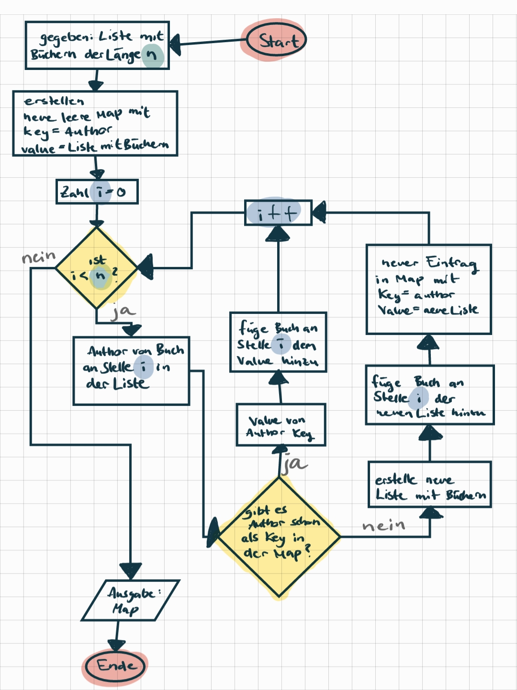
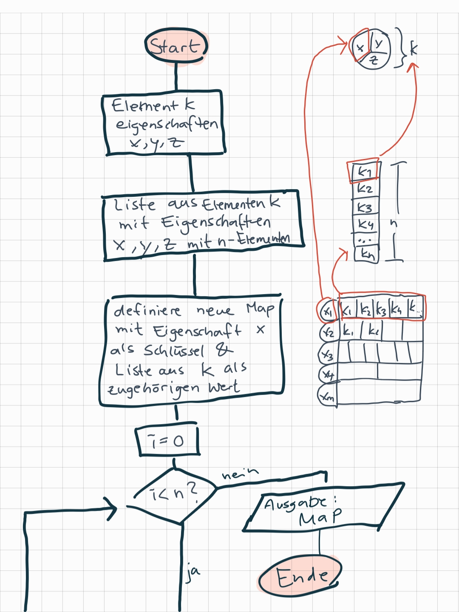
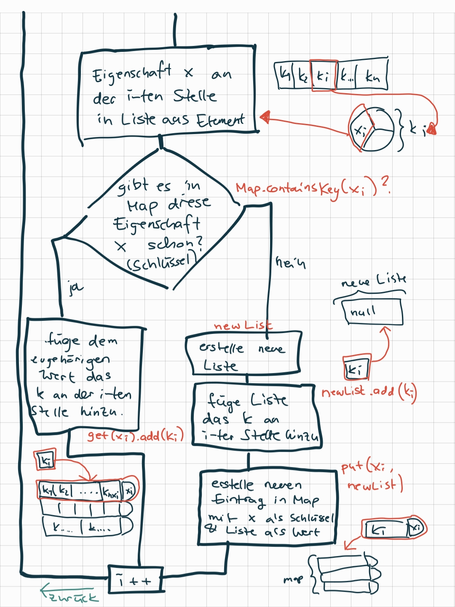

[#_documentation]
== Documentation

Ziel::
Eine Applikation zur Verwaltung von Büchern.
 Folgende Aufgaben soll die Applikation lösen können:
** Ein Buch (mit Angaben aller Attribute durch den User) in das System einspeichern
** Ein existierendes Buch aus dem System nach Stichwort aufrufen (Eingabe durch User)
** Ein exisitierendes Buch aus dem System löschen
** Alle Bücher anzeigen
** Alle Authoren anzeigen
*** gegebenfalls Bücher aller Authoren anzeigen
weitere Ziele:::
** Unterschiedliche User, mit Anmeldefunktion
** Löschen und Hinzufügen nur durch Admin (besonderer User)
** Jeder User kann im System Bucher suchen und Bücher favoritisieren: Favoritenliste

'''

Voraussetzungen::
* Serializable
** das System muss eine Speicherfunktion besitzen, in der Objekte als solches gespeichert und wieder aufgerufen werden können. Dafür müssen Klassen serialisierbar sein
* Listen
** die Objekte sollten in Listen gespeichert werden, da andernfalls eine Verwaltung sehr schwierig wird.
* Sortierbarkeit
** Die Bücher sollten eine Art Sortierbarkeit implementieren, um die Verwaltung (vorallem für die Suche) zu ermöglichen
** Ein Menü zur Ein- und Ausgabe vom User

====
[#_book-class]

Ein Buch enthält folgende Felder:

[source,java]
----
include::src/main/java/bk/set/Book.java[tags=bookFields]
----
* `String isbn` kann erweitert werden zu `Isbn isbn`.
* `String publisher` kann erweitert werden zu `Publisher publisher`.

====

====
[#_author-class]

Ein Author enthält folgende Felder:

[source,java]
----
include::src/main/java/bk/set/Author.java[tags=AuthorFields]
----
* Attribut `static int bookCount` kann hinzugefügt werden

====

[#_List-to-map]

====
Eine Idee, wie man die Liste in eine Map konvertieren kann:

Oder detailliert angezeigt wie hier:

====

