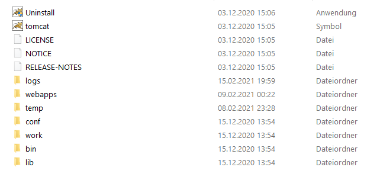
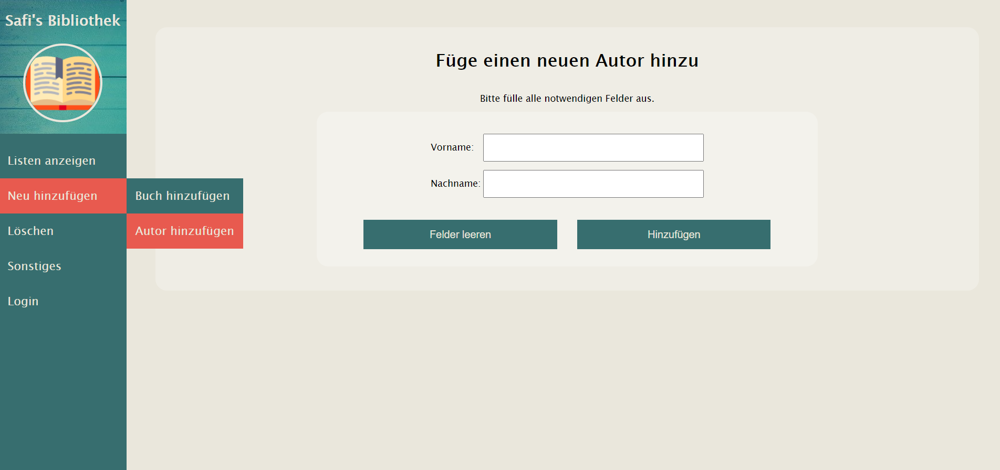
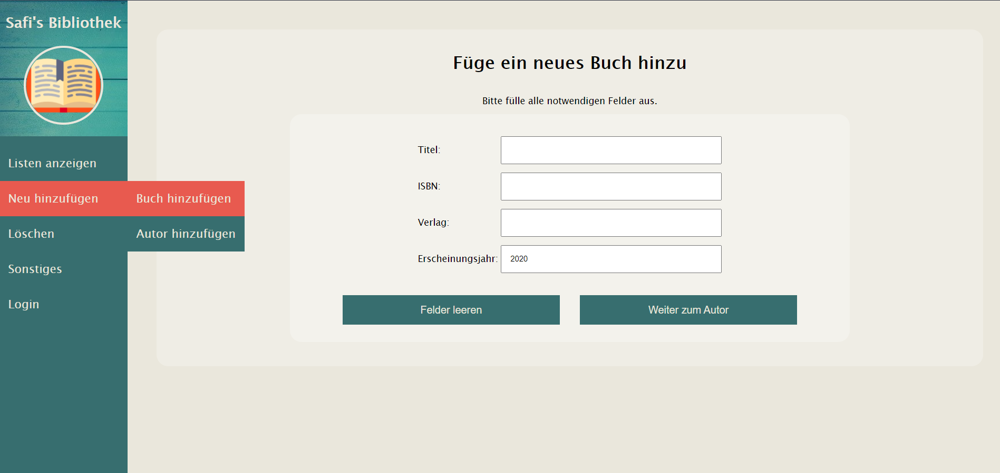
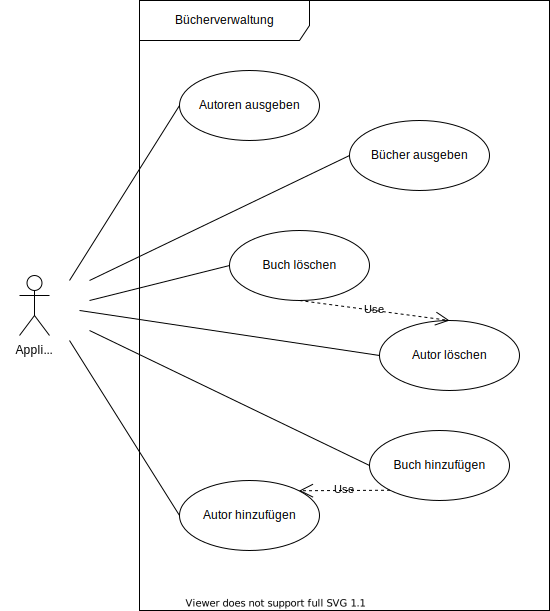
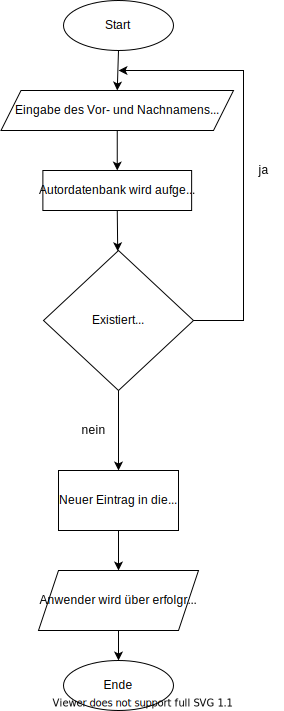
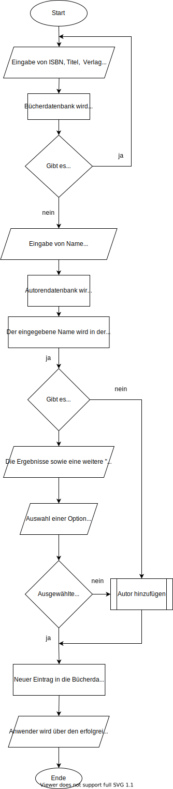
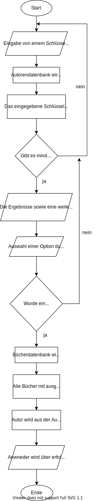

= image:img/openbook.png[] Bücherverwaltung
Safiye Uzun <safiye.uzun@msg.group>
v1.0, 2021-02-11
:toc:
:toc-title: Inhaltsverzeichnis

== Einleitung

Die Bücherverwaltungsapplikation ist eine Webanwendung, die die Verwaltung von Büchern und Autoren ermöglicht.
Die Applikation wird als _war-Datei_ geliefert und beinhaltet bereits eine kleine Sammlung an Beispielbüchern und -autoren.

=== Zielgruppen

Bei dieser Anwendung handelt es sich um ein Prototyp, welches im Lernprozess der Ausbildung entstanden ist und nur für diese Zwecke benutzt werden sollte. +
Prinzipiell ist die Applikation für Nutzer gedacht, die ihre eigene private Bücherbibliothek in einem Verzeichnis speichern möchten, um diese leichter zu verwalten.

=== Beschreibung

Der Anwender kann in der Bücherverwaltungsapplikation:

- die gespeicherten Bücher als Liste ausgeben
- die gespeicherten Autoren als Liste ausgeben
- neue Büchereinträge tätigen
- neue Autoreneinträge tätigen
- vorhandene Büchereinträge löschen
- vorhandene Autoreneinträge löschen

== How-To

=== Start

Aktuell ist das Starten der Anwendung ohne einen _Webcontainer_ nicht möglich.

=> TODO: INSTALL TOMCAT

Die Anwendungsdatei muss in folgenden Pfad gelegt werden
[source]
----
../Tomcat8/webapps/
----
So könnte ein Beispielverzeichnis eines Webcontainers aussehen:

Nach dem Verschieben der Datei in den genannten Pfad kann die der Webcontainer gestartet werden. +

Im Beispiel von Tomcat kann der Server über die _Eingabeaufforderung_ gestartet werden.
[source]
----
>cd c:/Program Files/Tomcat8/bin/
>startup
----
Mit einem beliebigen Browser kann man den lokalen Server nun durch
`http://localhost:8080/` erreichen.
Durch Anhängen des Dateinamens an die o.g. URI kann die Anwendung aufgerufen werden.

====
Beispiel:

Wenn Dateiname `book-app.war` lautet,
dann ist die Applikation über `http://localhost:8080/book-app/` erreichbar.
====

=== Menü
=== Hauptmenü

== Programmverlauf

=== Anwendungsfälle

Jeder Anwender hat vollen Zugriff auf die Bücher- und Autorenverwaltung und ist nicht auf eine bestimmte Personengruppe eingeschränkt.

Im nächsten Schritt werden die einzelnen Fälle näher erläutert.

[INFO]
====
Wichtig: Bei allen Anwendungsprozessen, in denen eine Eingabe durch den Anwender benötigt wird, ist davon auszugehen, dass die Eingabefelder ausgefüllt sind. Grundsätzlich gilt in der gesamten Anwendung, dass keine Felder leer stehen dürfen. +
_Ausnahme: Falsche oder unzulässige Jahresangaben werden durch das Jahr 2000 ersetzt._
====

=== Alle Einträge ausgeben

Bei den Fällen `Autoren ausgeben` und `Bücher ausgeben` handelt es sich um getrennte Prozesse und sollte deswegen grundsätzlich getrennt betrachtet werden. +
Aufgrund der Ähnlichkeiten und für eine bessere Verständlichkeit werden sie hier teilweise zusammengefasst.

[width=100%, cols=3*,frame=topbot, grid=rows]
|====
^.h|Name
^s| Alle Autoren
^s| Alle Bücher

^.h|Ziel
| Eine sortierbare Liste aller in der Datenbank vorhandenen Autoren anzeigen
| Eine sortierbare Liste aller in der Datenbank vorhandenen Bücher anzeigen

^.h|Akteure
|Alle Benutzer der Applikation
|Alle Benutzer der Applikation

^.h|Vorbedingungen
^| -
^| -

^.h|Prozess
| Autorendatenbank wird ausgelesen und dem Anwender tabellarisch angezeigt
| Bücherdatenbank wird ausgelesen und dem Anwender tabellarisch angezeigt

^.h| Weitere Optionen
| Die ausgegebene Tabelle kann vom Anwender alphabetisch nach *Vorname* oder *Nachname* sortiert werden
| Die ausgegebene Tabelle kann vom Anwender alphabetisch nach *Titel*, *Vorlage* oder numerisch nach *ISBN* sortiert werden

|====

====
Die genannten Optionen der Sortierung sind aktuell nur in eine Richtung möglich.

- Alphabetisch ist immer in alphabetischer Reihenfolge beginnend mit _a_
- Numerisch immer beginnend mit der kleinsten Zahl
====

=== Einträge hinzufügen

Die Fälle `Autor hinzufügen` und `Buch hinzufügen` sind ebenso getrennt voneinander zu betrachten, werden allerdings hier für eine bessere Verständlichkeit teilweise zusammengefasst.

[width=100%,cols=3*,frame=topbot, grid=rows]
|====
^h|Name
s|Autor hinzufügen
s| Buch hinzufügen

^.h|Ziel
|Einen neuen Eintrag in die Autorendatenbank tätigen
| Einen neuen Eintrag in die Bücherdatenbank tätigen

^.h|Akteure
|Alle Benutzer der Applikation
|Alle Benutzer der Applikation

^.h|Vorbedingungen
|Autor mit demselben Namen existiert noch nicht in der Datenbank
|Buch-ISBN existiert noch nicht als Eintrag in der Datenbank
|====
[width=100%,cols= 2*, frame=topbot, grid=cols]
|====
^h| _Autor hinzufügen_ Prozess
^h| _Buch hinzufügen_ Prozess

^| 
^| 

|====

=== Einträge löschen

Die Fälle `Autor löschen` und `Buch löschen` sind getrennte Prozesse, die hier aufgrund besserer Verständlichkeit teilweise zusammengefasst werden.

[width=100%,cols=3*,frame=topbot, grid=rows]
|====
^h|Name
s|Autor löschen
s| Buch löschen

^.h|Ziel
|Einen ausgewählten Autor aus der Bücherdatenbank entfernen
| Ein ausgewähltes Buch aus der Bücherdatenbank entfernen

^.h|Akteure
|Alle Benutzer der Applikation
|Alle Benutzer der Applikation

.2+^.h|Vorbedingungen
|Gesuchter Autor existiert in der Datenbank
|
|====

[width=100%,cols= 2*, frame=topbot, grid=cols]
|====
^h| _Autor löschen_ Prozess
^h| _Buch löschen_ Prozess

^| 
^| TODO
|====

== Glossar